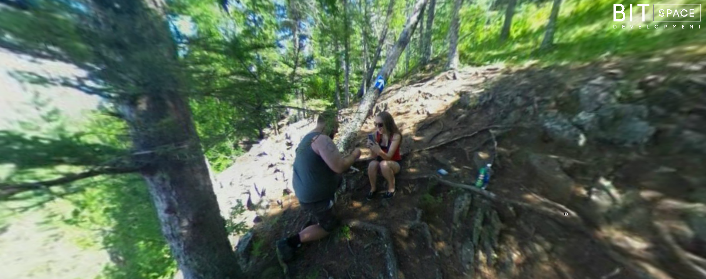

# Dan & Erin Engagement

**[View Live →](https://cmdann.github.io/engagement-pano/)**

I took Erin on a hike — the first one we ever went on together when we started dating. When I asked her to take a quick panorama at the summit, I pulled out a ring and proposed as she took it. She captured her own reaction.

[](https://cmdann.github.io/engagement-pano/)

## About

An interactive 360° panorama of the proposal moment. Navigate by clicking and dragging on desktop, touch-dragging on mobile, or put on a headset and enter VR mode. Find the ring hotspot to read the story.

| | |
|---|---|
| **Panorama** | Equirectangular, 2048 × 1024 |
| **Tech** | [A-Frame 1.6](https://aframe.io) — WebXR, no plugins required |
| **VR** | Meta Quest, HTC Vive, Google Cardboard, any WebXR headset |
| **Hosting** | GitHub Pages |

## Getting Started

Open `index.html` directly in a browser, or serve locally:

```bash
npx serve .
```

For VR: visit the live link on a WebXR-capable browser, then press the headset button in the bottom-right corner.

## License

This panorama and its images are licensed under the MIT License.

```
The MIT License (MIT)

Copyright (c) 2015 Daniel & Erin Blair

Permission is hereby granted, free of charge, to any person obtaining a copy
of this software and associated documentation files (the "Software"), to deal
in the Software without restriction, including without limitation the rights
to use, copy, modify, merge, publish, distribute, sublicense, and/or sell
copies of the Software, and to permit persons to whom the Software is
furnished to do so, subject to the following conditions:

The above copyright notice and this permission notice shall be included in
all copies or substantial portions of the Software.

THE SOFTWARE IS PROVIDED "AS IS", WITHOUT WARRANTY OF ANY KIND, EXPRESS OR
IMPLIED, INCLUDING BUT NOT LIMITED TO THE WARRANTIES OF MERCHANTABILITY,
FITNESS FOR A PARTICULAR PURPOSE AND NONINFRINGEMENT. IN NO EVENT SHALL THE
AUTHORS OR COPYRIGHT HOLDERS BE LIABLE FOR ANY CLAIM, DAMAGES OR OTHER
LIABILITY, WHETHER IN AN ACTION OF CONTRACT, TORT OR OTHERWISE, ARISING FROM,
OUT OF OR IN CONNECTION WITH THE SOFTWARE OR THE USE OR OTHER DEALINGS IN
THE SOFTWARE.
```

---

> "I got engaged today, she said yes." — [@CMDannCA](https://twitter.com/CMDannCA/status/630122813316329476), August 8, 2015
