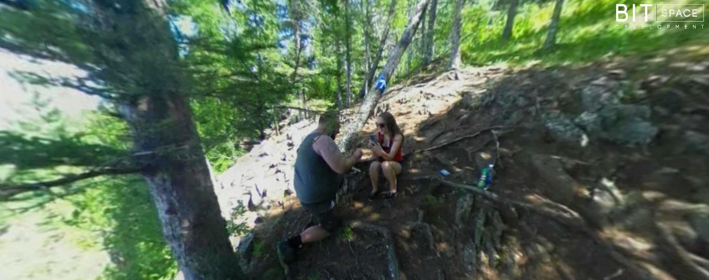

# Dan & Erin Engagement

I took her on a hike and stopped to take some panos. This hike was the fist one we went on togehter when we started dating. When I asked her to take a quick pano, I pulled out a ring and proposed as she took it. I captured her reaction. View the pano on my <a href="http://dan-blair.ca/projects/engagement/">portfolio site</a>.

<a href="http://dan-blair.ca/projects/engagement/"></a>

# License

The krpano viewer is closed source, you will need your own license. You can find it at http://krpano.com.

This pano and the images taken are registered under the MIT license.

```
The MIT License (MIT)

Copyright (c) 2015 Daniel & Erin Blair

Permission is hereby granted, free of charge, to any person obtaining a copy
of this software and associated documentation files (the "Software"), to deal
in the Software without restriction, including without limitation the rights
to use, copy, modify, merge, publish, distribute, sublicense, and/or sell
copies of the Software, and to permit persons to whom the Software is
furnished to do so, subject to the following conditions:

The above copyright notice and this permission notice shall be included in
all copies or substantial portions of the Software.

THE SOFTWARE IS PROVIDED "AS IS", WITHOUT WARRANTY OF ANY KIND, EXPRESS OR
IMPLIED, INCLUDING BUT NOT LIMITED TO THE WARRANTIES OF MERCHANTABILITY,
FITNESS FOR A PARTICULAR PURPOSE AND NONINFRINGEMENT. IN NO EVENT SHALL THE
AUTHORS OR COPYRIGHT HOLDERS BE LIABLE FOR ANY CLAIM, DAMAGES OR OTHER
LIABILITY, WHETHER IN AN ACTION OF CONTRACT, TORT OR OTHERWISE, ARISING FROM,
OUT OF OR IN CONNECTION WITH THE SOFTWARE OR THE USE OR OTHER DEALINGS IN
THE SOFTWARE.
```
# Getting Married

Needless to say I am pretty happy.

<blockquote class="twitter-tweet" lang="en"><p lang="en" dir="ltr">I got engaged today, she said yes. <a href="https://twitter.com/hashtag/love?src=hash">#love</a> <a href="https://twitter.com/hashtag/engagement?src=hash">#engagement</a> <a href="https://twitter.com/hashtag/hiking?src=hash">#hiking</a> <a href="https://twitter.com/hashtag/manitoba?src=hash">#manitoba</a>. We were doing what we love, and surprised her <a href="http://t.co/vuWitigKIy">pic.twitter.com/vuWitigKIy</a></p>&mdash; Daniel Blair (@CMDannCA) <a href="https://twitter.com/CMDannCA/status/630122813316329476">August 8, 2015</a></blockquote>
<script async src="//platform.twitter.com/widgets.js" charset="utf-8"></script>
